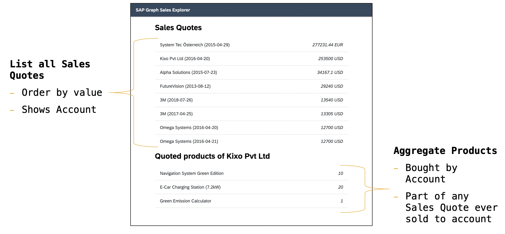

# 🎯 What you will learn 
In today's workshop you will gain a first overview of SAP Graph and how it can increase productivity in your development projects.

We want to teach you how to interact with SAP Graph's APIs. 
Since you probably already use some frameworks to build applications like SAP UI5, Angular, Flutter, React etc. 
we intentionally use plain HTML+JS as our focus is on the API itself and the OData syntax we support. 
SAP Graph aims to be compatible with as many open-source or commercial frameworks out there as possible. 

Do you have any feedback how we can best support your development activities? Please reach out to us 📬 

## 📊 App scope

Your company sells many products to its corporate customers. Your boss is interested in understanding how his sales team positions baskets of the most popular products (by quantity) at your largest customers. She asks you to quickly create a small app to explore this relationship.

## ℹ️ Prerequisits
* Basic understanding of HTML
* Basic understanding of JavaScript
* Basic understanding of HTTP network requests 

## 🛠 Tools 
* SAP Graph Business Data Graph 
  - Public Trial: `https://api-sandbox.graph.sap/api/v1`
* [SAP API Hub](https://api.sap.com)
* Any Webbrowser
  - recommended: [Chrome](https://www.google.com/chrome/)
* Any Text Editor/IDE of your choice
  - recommended: [Visual Studio Code](https://code.visualstudio.com/)
* [Fiori Fundamentals CSS Library](https://sap.github.io/fundamental-styles/)

## 👩‍🎓 How
See participant [handout here](./Workshop_Handout.pdf)

